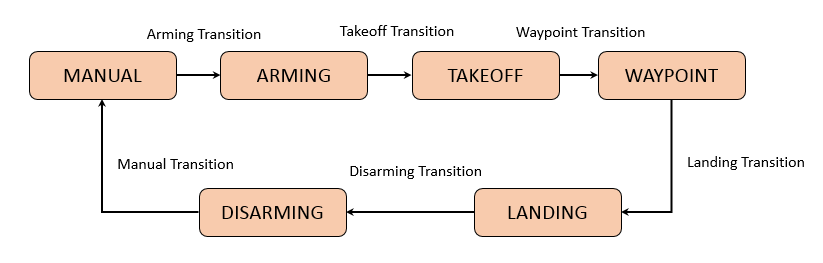
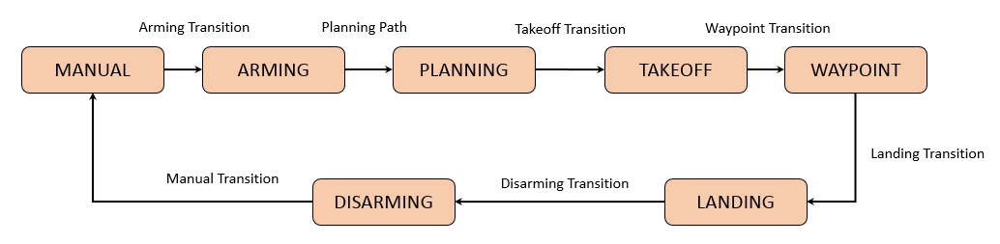

# Project 3D Motion Planning
Junqiang Zhou

---

## [Rubric](https://review.udacity.com/#!/rubrics/1534/view) Points

### Explain the Starter Code
Comparing to `backyard_flyer_solution.py` where the set of drone's waypoints is predefined and fixed, the script `motion_planning.py` adds an extra `PLANNING` state and `plan_path` function to generate waypoints from obstacles map and A* path planning algorithms.

The state transition sequence in `backyard_flyer_solution.py` is:

The state transition sequence in `motion_planning.py` is:

The `plan_path()` function generates waypoints of a flying path based on A* planning algorithm, given the environment map, the start and goal positions.
~~~
Step 1: Load the 2.5D obstacle map in the colliders.csv
Step 2: Construct a 2D grid/graph representation of the configuration space
Step 3: Define start and goal state
Step 4: Search a path from start to goal state using A* approach
Step 5: Prune the path to reduce number of points
Step 6: Convert the pruned path to drone's waypoints
~~~

The script `planning_utils.py` provides main functions where
~~~
`create_grid`: Construct a grid representation of a 2D configuration space based on given obstacle data, drone altitude and safety distance.
`heuristic`:  Calculate the approximated cost from current position to goal position based on Euclidean distance
`a_star`: Search a path from start to goal state on the grid with the given heuristic cost, and return the complete path consisting of all grid cells traveled from start to goal
~~~

### Implementing Your Path Planning Algorithm
#### 1. Set your global home position
Read the first line from csv file, extract the values of `lon0` and `lat0`, and use `set_home_position` to define global home. See line 126 - line 132 in `motion_planning.py`.

#### 2. Set your current local position
After getting the global position in geodetic framework, and use `global_to_local()` and convert to local position in NED framework. See line 134 in `motion_planning.py`.

#### 3. Set grid start position from local position
Define the `grid_start` at current local position, by calculating the difference between the local position and map center. See line 153 in `motion_planning.py`.

#### 4. Set grid goal position from geodetic coords
Given the global position of `grid_goal` in geodetic framework, use `global_to_local()` to compute the local position in NED framework. See line 157 - line 159 in `motion_planning.py`.

#### 5. Modify A* to include diagonal motion (or replace A* altogether)
To include diagonal motion, add `SOUTHEAST = (1,  1, sqrt(2)), SOUTHWEST = (1, -1, sqrt(2)), NORTHEAST = (-1, 1, sqrt(2)), NORTHWEST = (-1,-1, sqrt(2))` as actions as well as their corresponding cost. The valid actions can be found at line 150 - line 167 in `planning_utils.py`.

#### 6. Cull waypoints
To eliminate unnecessary waypoings, check if every three points(p1,p2,3) in the path are collinear. Since the planning is executed in 2D, simply set z coordinate to 1. Then, calculate the determinate of the matrix that includes the coordinates of these three points, and if the determinate is smaller than a threshold `epsilon`, the three points are collinear, and then remove the middle point from path. The code can be found at line 292 - line 316  in `planning_utils.py`.

Here is an example of planning path for the given environment using grid-based and graph-based A* approaches respectively.

### Execute the flight
For the grid-based implementation, run:

`python motion_planning.py --planning=GRID`

For the graph-based implementation, run:

`python motion_planning.py --planning=GRAPH`
